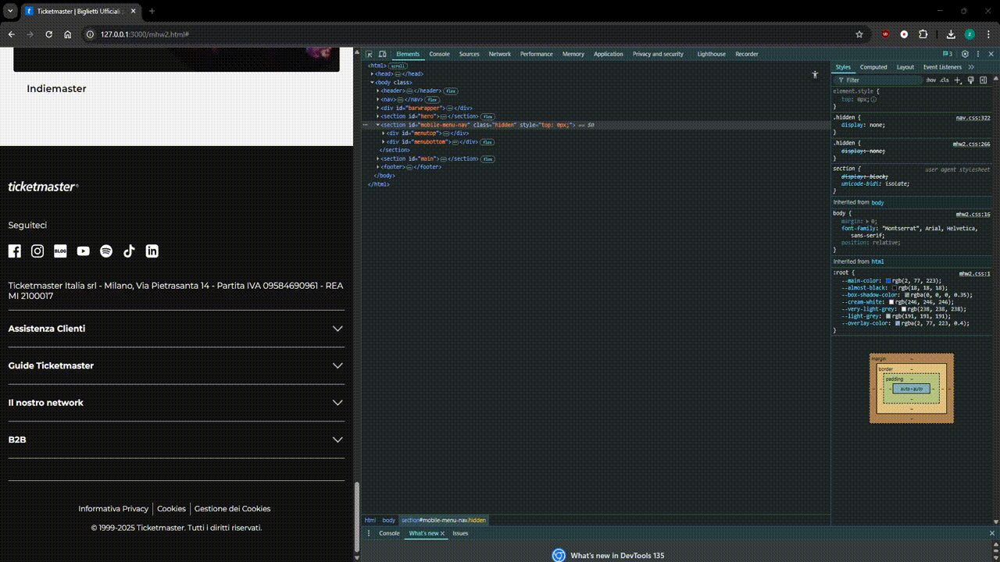

# MiniHomework 2
Consegna del secondo minihomework di Web Programming.

Ho spostato il CSS della nav, del footer e dell'header in dei file separati in vista dell'implementazione di altre pagine.

Si allegano in basso delle gif che mostrano le nuove feature del sito, possibili grazie all'uso di JavaScript.

# Screenshots

## Nav

    
Apri gif

    

## Menù Mobile

    
Apri gif

    

## Footer Mobile

    
Apri gif

    

